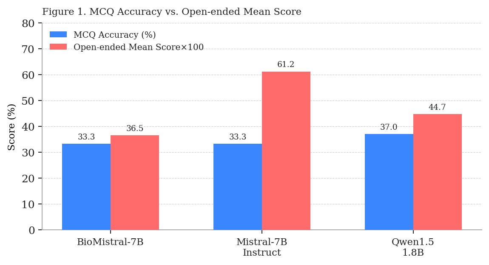
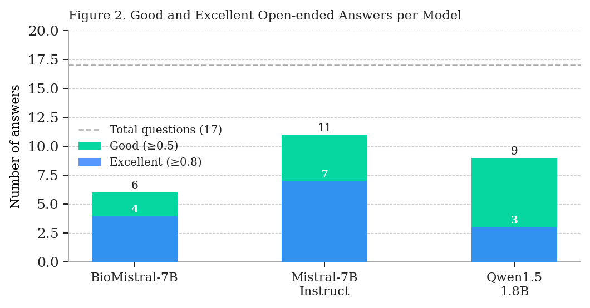
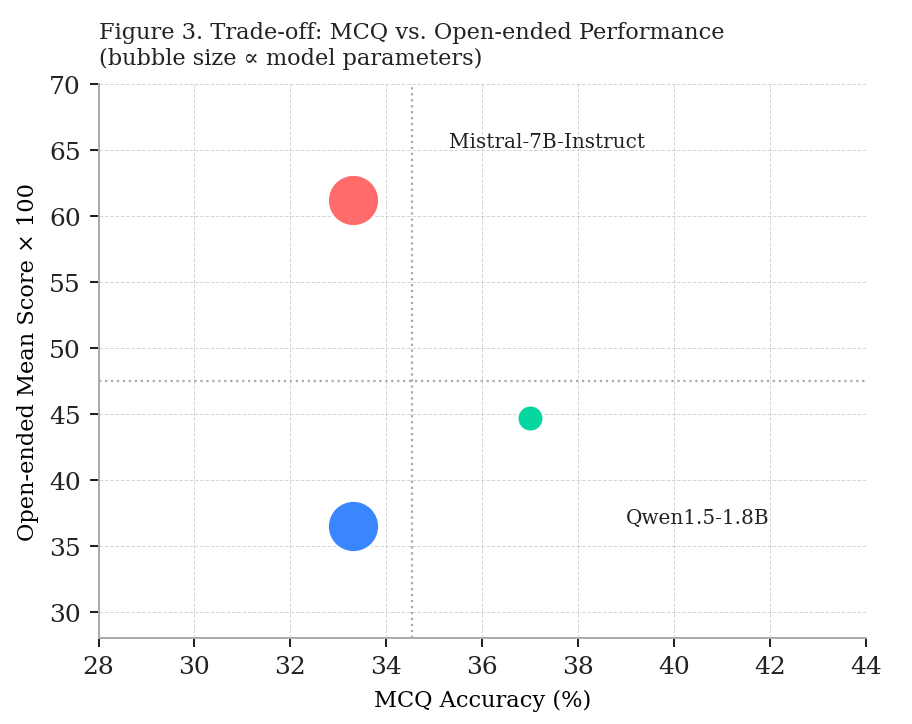

# Open-Source Small Language Model Evaluation on Medical Question Answering
 
**Universidade Federal de Sergipe (UFS)** · Graduate Program in Computer Science (PROCC)  
**Course:** Advanced Topics in Software Engineering and Information Systems  
**Professor:** Glauco Carneiro · **Semester:** 2026.1 · **Team:** 5 — Medical Domain
 
| | |
|---|---|
| **Student** | Moaath Almohammad Alshaikh |
| **Student ID** | 2024108522 |
| **Submission** | April 9, 2026 |
 
---
 
## Abstract
 
This report evaluates three open-source small language models (SLMs) on medical question answering tasks, in the context of Activity 1 for the course Advanced Topics in Software Engineering and Information Systems (PROCC/UFS, 2026.1). The models — BioMistral-7B, Mistral-7B-Instruct-v0.1, and Qwen1.5-1.8B-Chat — were assessed on 17 open-ended questions from the K-QA benchmark (questions 101–117) and 27 multiple-choice questions from the USMLE dataset (questions 163–189). Evaluation used Must-Have keyword coverage for open-ended tasks and accuracy for MCQ. Mistral-7B-Instruct led on open-ended performance (mean score 0.612), while Qwen1.5-1.8B marginally led on MCQ (37.0%). BioMistral-7B, despite domain-specific pretraining, underperformed on both tasks. Results highlight the disconnect between domain specialization and instruction-following ability in small models.
 
---
 
## 1. Introduction
 
The evaluation of language models in high-stakes domains such as medicine presents unique challenges. Models must not only retrieve factual knowledge but also produce responses that are clinically coherent and complete. This report focuses on small open-source models — those with fewer than 8 billion parameters — which are relevant in resource-constrained deployment scenarios, a central theme of the course curriculum.
 
Two complementary task formats are used: open-ended questions, which test free-form generation against expert-defined content requirements, and multiple-choice questions (MCQ), which test structured clinical reasoning. The datasets are K-QA, a real-world medical Q&A benchmark, and USMLE, a standardized clinical licensing exam.
 
---
 
## 2. Methodology
 
### 2.1 Models and Setup
 
Three models were evaluated:
 
| Model | HuggingFace ID | Parameters | Type |
|-------|---------------|------------|------|
| BioMistral-7B | `BioMistral/BioMistral-7B` | 7B | Medical domain |
| Mistral-7B-Instruct-v0.1 | `mistralai/Mistral-7B-Instruct-v0.1` | 7B | General |
| Qwen1.5-1.8B-Chat | `Qwen/Qwen1.5-1.8B-Chat` | 1.8B | General |
 
All models were loaded with 4-bit NF4 quantization (BitsAndBytes) on a T4 GPU in Google Colab, using bfloat16 compute dtype and double quantization enabled.
 
```python
BitsAndBytesConfig(
    load_in_4bit=True,
    bnb_4bit_quant_type="nf4",
    bnb_4bit_compute_dtype=torch.bfloat16,
    bnb_4bit_use_double_quant=True
)
```
 
### 2.2 Datasets
 
| Type | Source | Questions | Count |
|------|--------|-----------|-------|
| Open-ended (M1) | K-QA | 101–117 | 17 questions |
| Multiple Choice (M2) | USMLE | 163–189 | 27 questions |
 
The K-QA dataset provides clinical questions with expert free-form answers and structured Must-Have keyword lists. The USMLE dataset contains clinical vignette-style MCQs with official answer keys.
 
### 2.3 Metrics
 
**Open-ended questions — Must-Have Coverage Score:**
```
score = matched_keywords / total_must_have_keywords
```
A keyword phrase is matched if at least 50% of its tokens appear in the model response. Scores range from 0 to 1.
- **Good:** score ≥ 0.5
- **Excellent:** score ≥ 0.8
**Multiple-choice questions — Accuracy:**  
Standard accuracy (correct / total) after extracting the predicted letter via pattern matching.
 
---
 
## 3. Results
 
### 3.1 MCQ and Open-ended Overview
 

*Figure 1. MCQ Accuracy (%) vs. Open-ended Mean Score (×100) per model.*
 
No single model dominates both tasks. Mistral-7B-Instruct achieves the highest open-ended score (0.612) but ties for last on MCQ (33.3%). Qwen1.5-1.8B leads marginally on MCQ (37.0%) with a moderate open-ended score (0.447). BioMistral-7B underperforms on both dimensions despite its medical pretraining.
 
### 3.2 Open-ended Answer Quality
 

*Figure 2. Number of Good (≥0.5) and Excellent (≥0.8) answers per model (out of 17).*
 
Mistral-7B-Instruct produces the most Good (11) and Excellent (7) answers. Qwen1.5-1.8B achieves 9 Good and 3 Excellent answers — competitive considering its parameter count is 4× smaller. BioMistral-7B produces only 6 Good and 4 Excellent answers, with a high standard deviation (0.402) indicating inconsistent coverage across questions.
 
**Table 1. Open-ended evaluation metrics (Must-Have Coverage Score).**
 
| Model | Mean | Median | Std | Min | Max | Good ≥0.5 | Excellent ≥0.8 |
|-------|------|--------|-----|-----|-----|-----------|----------------|
| BioMistral-7B | 0.365 | 0.400 | 0.402 | 0.00 | 1.00 | 6 | 4 |
| **Mistral-7B-Instruct** | **0.612** | **0.600** | 0.372 | 0.00 | 1.00 | **11** | **7** |
| Qwen1.5-1.8B-Chat | 0.447 | 0.500 | 0.359 | 0.00 | 1.00 | 9 | 3 |
 
**Table 2. MCQ results (USMLE, 27 questions).**
 
| Model | Correct | Total | Accuracy |
|-------|---------|-------|----------|
| BioMistral-7B | 9 | 27 | 33.3% |
| Mistral-7B-Instruct | 9 | 27 | 33.3% |
| **Qwen1.5-1.8B-Chat** | **10** | **27** | **37.0%** |
 
### 3.3 Performance Trade-off
 

*Figure 3. Trade-off between MCQ accuracy and open-ended mean score. Bubble size reflects model parameter count.*
 
Figure 3 illustrates the inverse relationship between MCQ and open-ended performance. Mistral occupies the top-left quadrant (high open-ended, low MCQ) while Qwen is positioned to the right (higher MCQ). No model reaches the top-right quadrant, indicating that balanced performance across both task types remains unachieved among the evaluated SLMs.
 
---
 
## 4. Discussion
 
Mistral-7B was best at open-ended — mean score 0.612, with 7 excellent answers. But it scored only 33% on multiple choice. Qwen-1.8B was slightly better at multiple choice — 37%, a good result for such a small model. BioMistral was trained on medical texts but still scored the lowest on open-ended questions. Domain training alone is not enough.
 
Overall, all three models scored below 40% on multiple choice. USMLE questions are hard. Open-ended results showed more differentiation between the models.
 
A key implication for the course theme of open-source model benchmarking is that quantization-based deployment on free-tier GPUs is viable for comparative evaluation, even if absolute performance remains limited. The Must-Have metric provides richer differentiation than MCQ accuracy alone, and the two metrics surface different model capabilities.
 
---
 
## 5. Conclusion
 
This evaluation benchmarked three small open-source language models on real medical question-answering tasks. Mistral-7B-Instruct led on open-ended coverage while Qwen1.5-1.8B narrowly led on MCQ accuracy. BioMistral-7B did not benefit from its medical domain pretraining in these tasks, suggesting that instruction-following quality matters more than domain adaptation for structured QA prompting. All models fell below 40% MCQ accuracy, reflecting the difficulty of USMLE-level clinical reasoning for sub-8B parameter models.
 
---
 
## Repository Structure
 
```
.
├── README.md                          ← main repository overview + video link
│
├── Moaath/                            ← original submission folder
│   ├── README_Moaath.md
│   └── SUBMISSION.md
│
├── notebooks-ipynb/                   ← inference notebooks (one per model)
│   ├── moaath_BioMistral-7B.ipynb
│   ├── moaath_Mistral_7B_Instruct_v0_1.ipynb
│   └── moaath_Qwen1_5-1_8B-Chat.ipynb
│
├── results/                           ← CSV output files per model
│   ├── biomistral_mcq_moaath.csv
│   ├── biomistral_open_moaath.csv
│   ├── biomistral_summary.csv
│   ├── mistral_mcq_moaath.csv
│   ├── mistral_open_moaath.csv
│   ├── mistral_summary.csv
│   ├── qwen_mcq_moaath.csv
│   ├── qwen_open_moaath.csv
│   └── qwen_summary.csv
│
├── report/                            ← activity report + figures
│   ├── Moaath_Paper_Atividade_1.docx
│   ├── fig1_moaath.png
│   ├── fig2_moaath.png
│   └── fig3_moaath.png
│
└── video/                             ← demonstration video link
    └── VIDEO.md
```
 
---
 
## How to Reproduce
 
1. Open any notebook in `notebooks-ipynb/` in Google Colab with a **T4 GPU** runtime.
2. Mount Google Drive and adjust the file paths at the top of the notebook.
3. The datasets (`questions_w_answers.jsonl` and the USMLE CSVs) must be available at the configured paths.
4. Run all cells in order. Each notebook produces summary CSV files automatically.
Dependencies installed automatically inside each notebook:
```
transformers, accelerate, bitsandbytes, sentencepiece
```